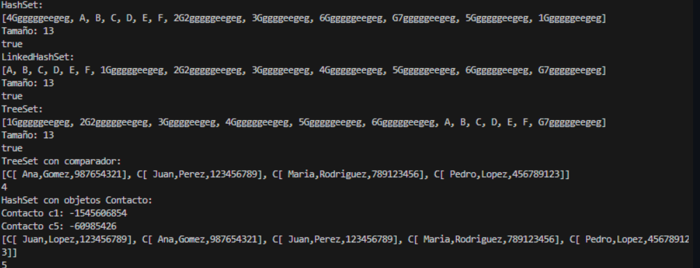
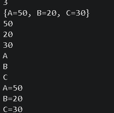

# Práctica: Árboles

## Datos del Estudiante
- **Nombre:** Gabriel Cuenca
- **Curso:** Grupo 3
- **Fecha:** 17/06/2026

---

## 1. IntTree

**Fecha:** 16/06/2026

**Descripción:** Se realizo un arbol con nodos enteros, ademas de los metodos preorder, posorder, inorder y calcular altura y peso del arbol generado.

---

## 2. BinaryTree

**Fecha:** 17/06/26
**Descripción:** Se creo la clase de BinaryTree y Person. Se creo un arbol que guarda objetos tipo Personas. En el BinaryTree se hizo que sean datos tipo genericos ademas de implementar validaciones para comparar las Personas por edad y si tienen la misma edad entonces por nombre.

## 3. Sets

**Fecha:** 24/06/2026
**Descripción:** En esta clase creamos dos proyectos uno llamado Sets y otro contacto, en Sets implementamos los Hash, HashSet, LinkedHashSet y SetTree, de los cuales comprobamos sus diferentes formas y caracteristicas que tiene cada uno haciendo varios cambios y usos.
En la clase Contacto creamos variables nombre, apellido y telefono en los cuales dando valores los metodos Set nos facilitaron tanto como para busqueda y comparacion.

## Codigo

## 4. Maps

**Fecha:** 29/06/2026
**Descripción:** Se creo la clase de Maps. Se crearon los metodos para construir tanto un Hash Map como un Tree Hash map, además de un coLinkedHashMaps.
