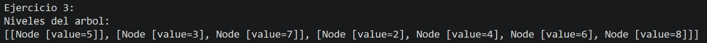
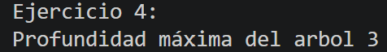

# Practica en Clases 2.2

## Datos del Estudiante
- **Nombre:** Gabriel Cuenca
- **Curso:** Grupo 3
- **Fecha:** 22/06/2026

---

# Ejercicio 1

```
public void insert(int[] numeros){
        BinaryTree<Integer> tree = new BinaryTree<>();

        for(int numero: numeros){
            tree.insert(numero);
        }

        printTree(tree.getRoot());
    }
```
El método `insert` crea un árbol binario vacío y le inserta todos los números del arreglo con el for each. Después de agregar todos los elementos, obtiene la raíz del árbol y llama a printTree para imprimir el arbol.

```
public void printTree(Node<Integer> root){
        System.out.println("Imprimiendo el arbol");
        printTreeRecursivo(root,0);
    }
```
El método `printTree` icia la impresión del árbol. Primero muestra el mensaje “Imprimiendo el arbol” y luego llama a printTreeRecursivo, enviando la raíz y el nivel 0.


```
private void printTreeRecursivo(Node<Integer> actual, int nivel) {
        if (actual == null)
            return;

        printTreeRecursivo(actual.getRight(), nivel + 1);

        for (int i = 0; i < nivel; i++) {
            System.out.print("\t");
        }
        System.out.println(actual.getValue());

        printTreeRecursivo(actual.getLeft(), nivel + 1);
    }
```

El método `printTreeRecursivo` imprime un árbol binario de forma recursiva usando el nivel para dar formato. Primero recorre el subárbol derecho, luego imprime el nodo actual con tabulaciones según su nivel, y finalmente recorre el subárbol izquierdo.


### Salida de consola:


# Ejercicio 2


```
public Node<T> invertTree(Node<T>root){

        invertRecursively(root);

        printTree(root);

        return root;
        

    }
```
El método `invertTree` invierte un árbol binario llamando a un método recursivo que intercambia sus ramas izquierda y derecha. Luego imprime el árbol invertido con `printTree` y luego devuelve la raíz del árbol ya modificado.

```
private void invertRecursively(Node<T> root){
        if(root == null){
            return;
        }

        Node<T> temp = root.getLeft();
        root.setLeft(root.getRight());
        root.setRight(temp);

        invertRecursively(root.getLeft());
        invertRecursively(root.getRight());
    }
```

El método `invertRecursively` invierte un árbol binario cambiando los hijos izquierdo y derecho de cada nodo. Si el nodo es null, termina el método. Si no, primero guarda el hijo izquierdo en una variable temporal temp, luego asigna el hijo derecho al lado izquierdo del nodo y después pone temp (el antiguo izquierdo) como hijo derecho.

Finalmente, llama recursivamente al mismo proceso en el hijo izquierdo y en el hijo derecho para invertir todo el árbol.


```
public void printTree(Node<T> root){
        System.out.println("Imprimiendo el arbol invertido");
        printTreeRecursivo(root,0);
    }
```

El método `printTree` icia la impresión del árbol. Primero muestra el mensaje “Imprimiendo el arbol” y luego llama a printTreeRecursivo, enviando la raíz y el nivel 0.

```
private void printTreeRecursivo(Node<T> actual, int nivel) {
        if (actual == null)
            return;

        printTreeRecursivo(actual.getRight(), nivel + 1);

        for (int i = 0; i < nivel; i++) {
            System.out.print("\t");
        }
        System.out.println(actual.getValue());

        printTreeRecursivo(actual.getLeft(), nivel + 1);
    }
```
El método `printTreeRecursivo` imprime un árbol binario de forma recursiva usando el nivel para dar formato. Primero recorre el subárbol derecho, luego imprime el nodo actual con tabulaciones según su nivel, y finalmente recorre el subárbol izquierdo.

### Salida de consola:


# Ejercicio 3

```
public List<List<Node<T>>> listLevels(Node<T> root) {
        List<List<Node<T>>> resultado = new ArrayList<>();

        if (root == null) {
            return resultado;
        }

        Queue<Node<T>> queue = new LinkedList<>();
        queue.offer(root);

        while (!queue.isEmpty()) {
            int size = queue.size();
            List<Node<T>> level = new LinkedList<>();

            for (int i = 0; i < size; i++) {
                Node<T> actual = queue.poll();
                level.add(actual);

                if (actual.getLeft() != null) {
                    queue.offer(actual.getLeft());
                }

                if (actual.getRight() != null) {
                    queue.offer(actual.getRight());
                }
            }

            resultado.add(level);
        }

        return resultado;
    }
```

El método `listLevels` primeramente crea una lista llamada resultado donde se almacenarán todos los niveles del árbol. Si la raíz es null devuelve una lista vacía sino crea una cola y agrega la raíz para el recorrido.
Mientras la cola tenga elementos, obtiene la cantidad de nodos que existen en el nivel actual y crea una lista llamada level para almacenarlos. Luego recorre todos los nodos de ese nivel y los agrega a la lista y si es que tienen hijos izquierdo o derecho los inserta en la cola para procesarlos en el siguiente nivel. Finalmente, agrega cada nivel a la lista resultado y cuando termina el recorrido devuelve el arbol con todos sus niveles.

### Salida de consola:



# Ejercicio 4
```
public int maxDepth(Node<T> root){
        return alturaRecursivo(root);
    }
```
El método `maxDepth` llama al método recursivo alturaRecursivo, enviando la raíz del árbol y devuelve el resultado.

```
private int alturaRecursivo(Node<T> actual){
        if(actual == null)
            return 0;
        int alturaIzquierda = alturaRecursivo(actual.getLeft());
        int alturaDerecha = alturaRecursivo(actual.getRight());

        return Math.max(alturaIzquierda, alturaDerecha)+1;

    }
```
El método `alturaRecursivo` calcula la altura de un árbol binario de forma recursiva. Si el nodo actual es null, devuelve 0 porque no hay niveles, pero si el nodo el nodo si existe, calcula la altura del subárbol izquierdo y la altura del subárbol derecho llamándose a sí mismo para cada hijo. Luego compara ambas alturas utilizando el Math.max y toma la mayor altura de las dos obtenidas y le va sumando 1 para contar el nodo actual y finalmente retorna el valor calculado siendo la altura o profundidad máxima del arbol.

### Salida de consola:


